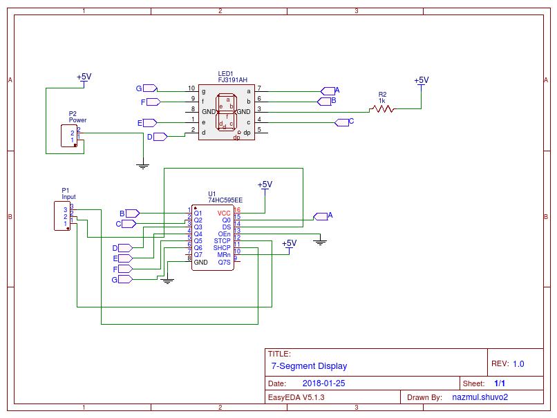

# 7-Segment-Display-with-Shift-Register
A common anode 7-Segment drive with 74HC595 Shift Register

# HERE THE CIRCUIT DIAGRAM




# Arduino IDE Code::
```
// Written by:
// Nazmul Alam Shuvo
// NAS TEC PVT. LTD.

int latchPin = 2; //pin 12 on the 595
int dataPin = 3; //pin 14 on 595
int clockPin = 4; //pin 11 on 595


void setup() {
  // put your setup code here, to run once:

  pinMode(latchPin, OUTPUT);
  pinMode(dataPin, OUTPUT);
  pinMode(clockPin, OUTPUT);
}

void loop() {
  // put your main code here, to run repeatedly:

//0 Digit
digitalWrite(latchPin, LOW);
shiftOut(dataPin, clockPin, MSBFIRST, 64);
digitalWrite(latchPin, HIGH);
delay(1000);

//1 Digit

digitalWrite(latchPin, LOW);
shiftOut(dataPin, clockPin, MSBFIRST, 121);
digitalWrite(latchPin, HIGH);
delay(1000);

//2 Digit

digitalWrite(latchPin, LOW);
shiftOut(dataPin, clockPin, MSBFIRST, 36);
digitalWrite(latchPin, HIGH);
delay(1000);
 
//3 Digit
digitalWrite(latchPin, LOW);
shiftOut(dataPin, clockPin, MSBFIRST, 48);
digitalWrite(latchPin, HIGH);
delay(1000);

//4 Digit
digitalWrite(latchPin, LOW);
shiftOut(dataPin, clockPin, MSBFIRST, 25);
digitalWrite(latchPin, HIGH);
delay(1000);

//5 Digit
digitalWrite(latchPin, LOW);
shiftOut(dataPin, clockPin, MSBFIRST, 18);
digitalWrite(latchPin, HIGH);
delay(1000);

//6 Digit
digitalWrite(latchPin, LOW);
shiftOut(dataPin, clockPin, MSBFIRST, 2);
digitalWrite(latchPin, HIGH);
delay(1000);

//7 Digit
digitalWrite(latchPin, LOW);
shiftOut(dataPin, clockPin, MSBFIRST, 120);
digitalWrite(latchPin, HIGH);
delay(1000);

//8 Digit
digitalWrite(latchPin, LOW);
shiftOut(dataPin, clockPin, MSBFIRST, 0);
digitalWrite(latchPin, HIGH);
delay(1000);

//9 Digit
digitalWrite(latchPin, LOW);
shiftOut(dataPin, clockPin, MSBFIRST, 24);
digitalWrite(latchPin, HIGH);
delay(1000);


}
```
